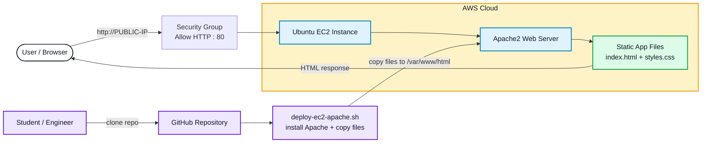

# Project 01 (AWS): Application Deployment on EC2

Welcome to your first AWS hands-on project. In this project, you will create an Ubuntu EC2 server, deploy a simple website using Apache2, and access it from the browser using the public IP.

> Goal: Learn the basic real-world flow: **create server → connect → deploy app → verify in browser**.

## Agenda (What we will do)
1. Create an **EC2 instance** (Linux) and open **HTTP (80)**.
2. Connect using **either**:
   - Option A: **MobaXterm** (uses the downloaded `.pem` key locally)
   - Option B: **AWS Console “Connect”** (browser terminal; often no local key needed)
3. On the EC2 server: **clone your project repository** → **run 1 command to deploy** → restart Apache.
4. Access the website using the instance **Public IPv4**.

## End of Project (What you will achieve)
After completing this project, you will be able to:
- Launch an EC2 instance with a security group that allows `HTTP : 80`.
- SSH/connect to the instance using MobaXterm or AWS Console Connect.
- Clone a repo and deploy its web files to Apache (`/var/www/html`).
- Open your site in a browser: `http://<PUBLIC-IP>`.

---

## Architecture

This colorful architecture flow shows two important parts:
- **User flow**: Browser request reaches EC2 and Apache returns the web page.
- **Deployment flow**: Student clones the repo and runs the deployment script.

### EC2 Application Deployment Flow



---

## Repository Files

| File | Purpose |
|---|---|
| `README.md` | Step-by-step project blog |
| `index.html` | Sample website page |
| `styles.css` | Website styling |
| `deploy-ec2-apache.sh` | Installs Apache2 and deploys files to `/var/www/html` |

---

## SECTION 1: Create EC2 (simple setup)

1. Open AWS Console → search **EC2** → go to **EC2 Dashboard**.
2. Click **Launch instances**.
3. Fill:
   - **Name**: `WebApp-EC2-01`
   - **AMI**: `Ubuntu Server 22.04 LTS` (free tier eligible)
   - **Instance type**: `t2.micro`
   - **Key pair**: create/download a key pair (for Option A)
4. **Security group (most important)**
   - Create a new security group named `WebAppSG`
   - Add inbound rules:
     - `SSH` TCP `22` → Source: `My IP`
     - `HTTP` TCP `80` → Source: `Anywhere-IPv4`
5. Click **Launch instance**.
6. Wait until **Instance state = Running**.

---

## SECTION 2: Connect to EC2 (2 options)

### Option A (Recommended): MobaXterm (uses the downloaded `.pem`)
1. Open **MobaXterm** → **Session** → **SSH**
2. Enter:
   - **Remote host**: EC2 **Public IPv4**
   - **Username**: `ubuntu`
   - **Port**: `22`
   - **Private key**: select your downloaded `*.pem`
3. Click **OK / Connect**

If you get a key permission error locally, run:
```bash
chmod 400 /path/to/your-key.pem
```

### Option B: AWS Console “Connect” (browser terminal)
1. EC2 → Instances → select your instance
2. Click **Connect**
3. Choose **EC2 Instance Connect** / **Browser SSH** (if available)
4. Click **Connect** to open the terminal in the browser

Note: If you do not see browser connect options, use **Option A**.

---

## SECTION 3: Clone repo and deploy to Apache (one-shot)

### Step 3.1 Login to the instance
After connecting (Option A or B), you will be in a terminal on the EC2 server.

### Step 3.2 Clone your repo
1. After you log into EC2, your terminal will already be in your home folder.
2. Create a fixed folder (so students don’t get confused) and go inside it:
   ```bash
   mkdir -p ec2appdeployment
   cd ec2appdeployment
   ```
3. Clone the repo directly into this folder (clone contents into the current directory):
   ```bash
   git clone https://github.com/devopsmate7/-AWS-Project-01-EC2-deployment.git .
   ```
4. Requirements for this project:
   - Your repo root should contain web files like `index.html` (and optional CSS/assets).
   - Your repo root should include `deploy-ec2-apache.sh` (so you can run the one-shot deployment).
5. Verify you can see the files:
   ```bash
   ls -la
   ```

### Step 3.3 Run deployment script (copy + restart)
Run:
```bash
chmod +x ./deploy-ec2-apache.sh
./deploy-ec2-apache.sh
```

This script will:
- install/start Apache (`apache2`)
- copy the repo web files (like `index.html` and `styles.css`) to `/var/www/html`
- restart Apache

### Step 3.4 Confirm (optional but quick)
```bash
curl -I http://localhost
```
You should see something like `HTTP/1.1 200 OK`.

---

## SECTION 4: Access from your laptop (Public IP)
1. EC2 → Instances → select your instance
2. Copy **Public IPv4 address**
3. Open in browser:
   ```text
   http://<PUBLIC-IP>
   ```

---

## SECTION 5: Cleanup (remove charges)
When finished:
- EC2 → Instances → select your instance
- **Instance state** → **Terminate instance**

